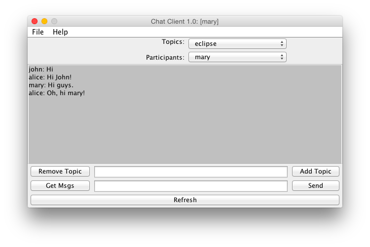
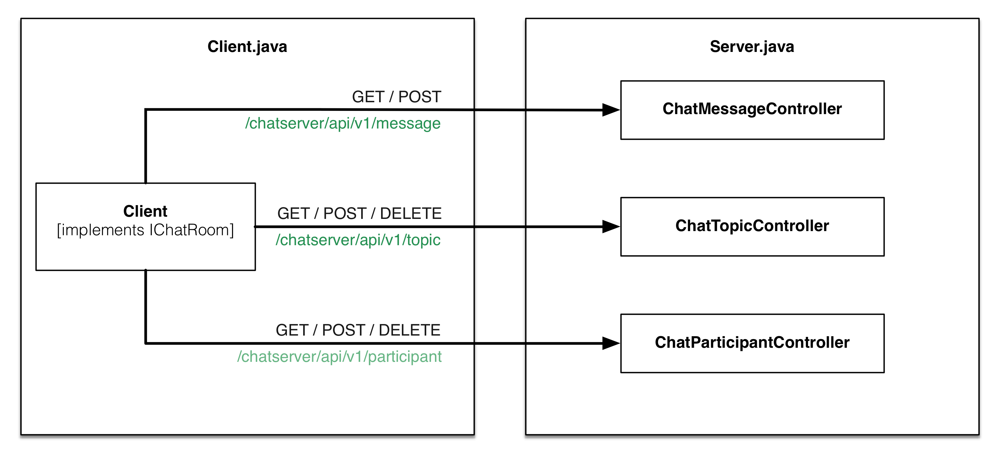

## ServletChat Documentation

**Author: Livio Bieri**  
**Date: April 2015**

#### Sources
The following source code files have been created in order to solve the task.

##### Client-Side / Server-Side:
- [Client.java](https://github.com/livioso/kvanC/blob/master/YetAnotherChat/src/ch/fhnw/kvan/chat/servlet/Client.java)
- [Server.java](https://github.com/livioso/kvanC/blob/master/YetAnotherChat/src/ch/fhnw/kvan/chat/servlet/Server.java)

#### User Interface

### Overview

**Description:**  

There are three different controllers that are responsible for calls from the client: 

- **ChatParticipantController** responsible for `GET`,`POST` on */chatserver/api/v1/participant*.
- **ChatTopicController** responsible for `GET`,`POST`, `DELETE` on */chatserver/api/v1/topic*.
- **ChatMessageController** responsible for `GET`,`POST`, `DELETE` on */chatserver/api/v1/message*.

**Note:** *There is not separate `web.xml` for configuration each of the three controller is annotate with the [`@WebServlet`](https://docs.oracle.com/javaee/6/api/javax/servlet/annotation/WebServlet.html) annotation.*

### Description of REST API:
The client can send the following HTTP request to the server:

###### Add New User: *Client signed in*
	POST: /chatserver/api/v1/participant?username=<username>

###### Remove User: *Client signed off*
	DELETE: /chatserver/api/v1/participant?username=<username>
	
###### Get All Participants: *Requesting all participants*
	GET: /chatserver/api/v1/participant

###### Add Topic: *Client wants to add topic*
	POST: /chatserver/api/v1/topic?name=<topic>

###### Remove Topic: *Client wants to removed topic*
	DELETE: /chatserver/api/v1/topic?name=<topic>
	
###### Get All Topics: *Requesting all topics*
	GET: /chatserver/api/v1/topic

###### Add Message: *Clients wants to add message*
	POST: /chatserver/api/v1/message?topic=<topic>&message=<message>

###### Get Latest Messages: *Requesting messages for a topic*
	GET: /chatserver/api/v1/message?topic=<topic>