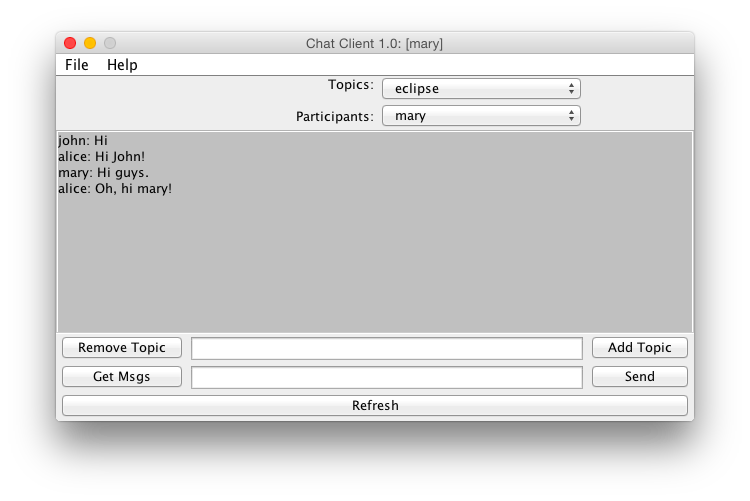
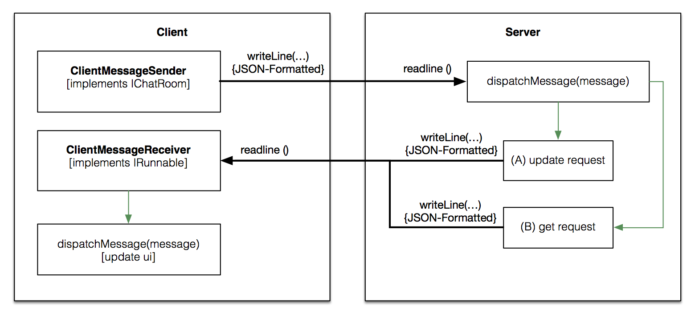

## SocketChat Documentation

**Author: Livio Bieri**  
**Date: March 2015**

#### Sources
The following source code files have been created in order to solve the task.

##### Client-Side:
- [Client.java](https://github.com/livioso/kvanC/blob/master/YetAnotherChat/src/ch/fhnw/kvan/chat/socket/client/Client.java)
- [ClientMessageReceiver.java](https://github.com/livioso/kvanC/blob/master/YetAnotherChat/src/ch/fhnw/kvan/chat/socket/client/ClientMessageReceiver.java)
- [ClientMessageSender.java](https://github.com/livioso/kvanC/blob/master/YetAnotherChat/src/ch/fhnw/kvan/chat/socket/client/ClientMessageSender.java)

##### Server-Side:
- [Server.java](https://github.com/livioso/kvanC/blob/master/YetAnotherChat/src/ch/fhnw/kvan/chat/socket/server/Server.java)
- [ConnectionListener.java](https://github.com/livioso/kvanC/blob/master/YetAnotherChat/src/ch/fhnw/kvan/chat/socket/server/ConnectionListener.java)
- [ConnectionHandler.java](https://github.com/livioso/kvanC/blob/master/YetAnotherChat/src/ch/fhnw/kvan/chat/socket/server/ConnectionHandler.java)

#### User Interface

### Overview

**Description:**

The overview shows the situation after the client connected with the server. The server created an instance of **ConnectionHandler** after the client connected to the port `1235` which got detected by **ConnectionListener** (more accurately `accept()`). Then the ConnectionHandler thread started listening on a `InputStream` on this particular client socket. Waiting for client messages and dispatching when received (by `readline()` using `dispatchMessage()`) the thread lives as long as the client remains connected. `dispatchMessage()` then tries to parse the received String as JSON and looks up the key `action` which indicates what kind of action is expected to happen (example: `remove_participant`). From there the actual dispatch can be started and depending on the `action` the server performs the requested task. As soon as the request has been processed (e.g. updated the **ChatRoom** singleton held by the server) all clients get a notification about what changed. The format of this message is JSON as well. Each client is then expected to dispatch this information and update its user interface (this is done by **ClientMessageReceiver** (see `dispatchMessage()`).

### Client
The client can send the following request to the server:

###### Add New User: *Client signed in*
	{"action":"new_user","name":"mary"}

###### Remove User: *Client signed off*
	{"action":"remove_user","name":"mary"}

###### Add Topic: *Client wants to add topic*
	{"action":"add_topic","topic":"whatever"}

###### Remove Topic: *Client wants to removed topic*
	{"action":"remove_topic","topic":"whatever"}

###### Add Message: *Clients wants to add message*
	{"action":"add_message","message":"hi","topic":"whatever"}

###### Get Latest Messages: *Requesting 10 most recent messages*
	{"action":"get_latest_messages"}

**Response:** *See Server Notifications - Response Latest Messages*

###### Get All Topics: *Requesting all topics*
	`{"action":"get_all_topics"}`

**Response:** *See Server Notifications - Response All Topics*

###### Get All Participants: *Requesting all participants*
	`{"action":"get_all_participants"}`

**Response:** *See Server Notifications -  Response All Participants*

### Server Messages
The server can send the following messages to the client (this are replies to client request calls).

#### Broadcast notifications to _all_ Clients:

###### New User Added: *A new user got added*
	{"action":"new_user","name":"mary"}

###### Removed User: *A user has sign out*
	{"action":"remove_user","name":"mary"}

###### Added Topic: *A new topic has been added*
	{"action":"add_topic","topic":"whatever"}

###### Removed Topic: *A topic has been removed*
	{"action":"remove_topic","topic":"whatever"}

###### Added Message: *A new message has been added*
	{"action":"add_message","message":"hi","topic":"whatever"}

#### Unicast notifications to a _single_ Client:

###### Response Latest Messages: *The client initially needs to know the latests messages*
	{"action":"response_latest_messages","messages":"message2;message1"}

###### Response All Topics: *The client initially needs to know topics*
	{"action":"response_all_topics","topics":"topic1;topic2"}

###### Response All Participants: *The client initially needs to know the participants*
	{"action":"response_all_participants","participants":"alice;bob"}
